### 一、基础

#### 1.人工智能（AI）

人工智能是使计算机模拟人类智能行为的科学，包括学习、推理和自我改进。是一个广泛涉及计算机科学、数据分析、统计学、机器工程、语言学、神经科学、哲学和心理学等多个学科的领域

人工智能按照技术实现的不同可被划分为多个子领域，各个子领域之间往往相互关联和影响。人工智能的子领域包括机器学习（ML）、深度学习（DL）、生成式人工智能、自然语言处理（NLP）等

##### Ⅰ.机器学习（ML）

机器学习是人工智能的一个分支，使计算机能够通过数据和算法自动学习并改进其性能，可以分为监督学习，无监督学习和强化学习

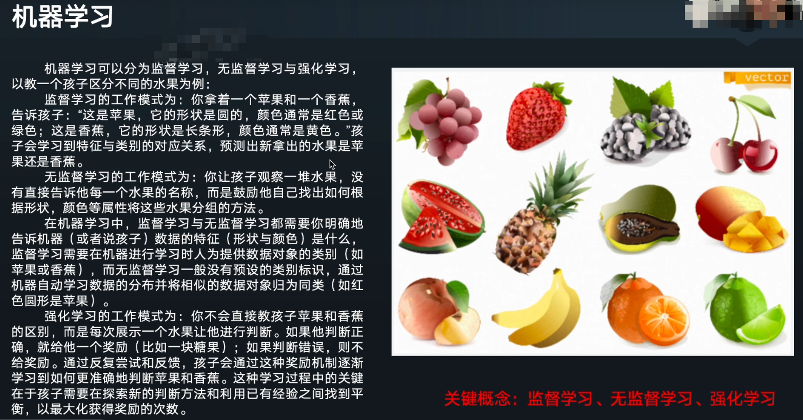

##### Ⅱ.深度学习（DL）

深度学习是机器学习的一种方法，主要使用神经网络模型（由多个隐藏层组成）对数据进行学习和表示，使得机器能够执行高级模式识别和预测

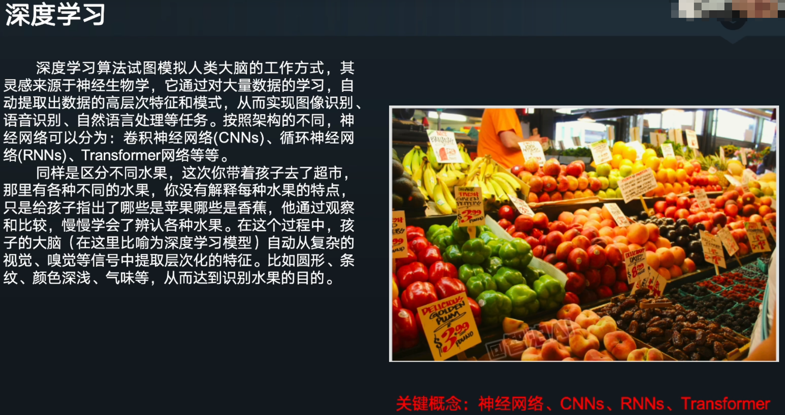

* 神经网络

  1. 神经元和网络概念

     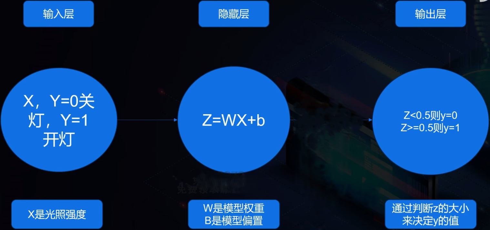

     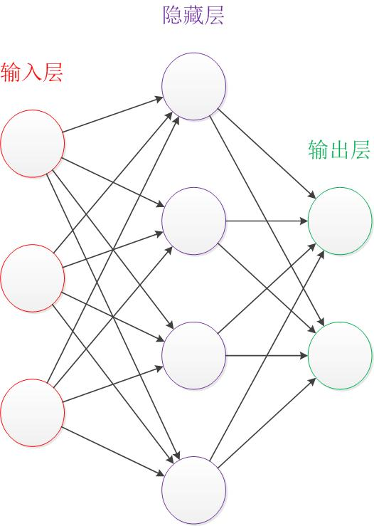

  2. 前向和反向传播原理

     * 前向传播：将上一层的输出作为下一层的输入，并计算下一层的输出，一直到运算到输出层为止
     * 反向传播：实际上，反向传播仅指用于计算梯度的方法。而另一种算法，例如随机梯度下降法，才是使用该梯度来进行学习。原则上反向传播可以计算任何函数的到导数

  3. 深度学习中常用模型

     * 卷积神经网络（CNN）：

       一种深度学习网络，基本原理使卷积运算，可以有效地处理图像和视频数据，被广发应用于图像分类、图像识别、视频分析等领域

     * 循环神经网络（RNN）

       一种序列神经网络，在处理连续输入和输出数据时非常有效，广泛应用在语音、自然语言等领域

##### Ⅲ.生成式人工智能

生成式人工智能又是深度学习中快速增长的子集，它们使用了大模型提供支持，在大量原始、未标记的数据基础上对深度学习模型进行预训练，使得机器能够“理解”语言甚至图像，并能根据需要自动生成内容

##### Ⅳ.自然语言处理（NLP）

使计算机能够理解、解释和生成人类语言，通过算法和大量的数据训练，NLP能够从复杂的语言输入中提取有意义的信息。应用包括机器翻译、语音识别、情感分析、文本摘要、聊天机器人等。大模型如：ChatGPT、ChatGLM、文心一言等

* Transformer模型

  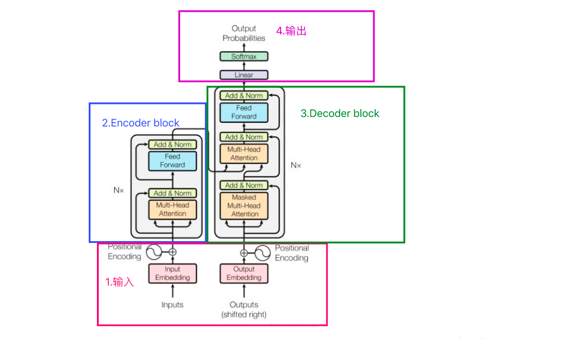

#### 2.大模型（LLM）

大模型（LLM）是指在机器学习和人工智能领域中，使用了大量数据进行训练，拥有庞大参数量的深度学习模型。这些模型通过大规模的数据训练，能够捕捉到复杂的数据模式，从而在多种任务上表现出色。他们通常需要大量的计算资源，能够处理自然语言处理（NLP）、图像识别等多种复杂的任务

大模型时间线：

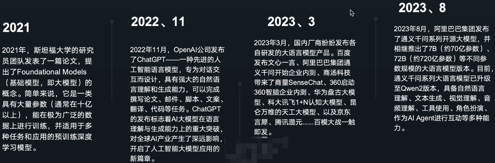

大模型排行：

[SuperCLUE中文大模型测评基准——评测榜单](https://www.superclueai.com/)

#### 3.大模型的使用与训练

##### Ⅰ.大模型的使用

在官网上直接向大模型提出需求

##### Ⅱ.大模型的训练

整体分为三个阶段：预训练、SFT（监督微调）以及RLHF（基于人类反馈的强化学习）

###### i.预训练

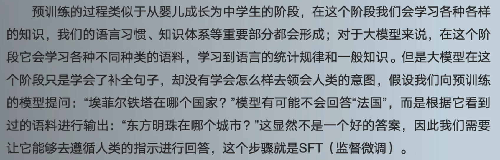

###### ii.SFT（监督微调）

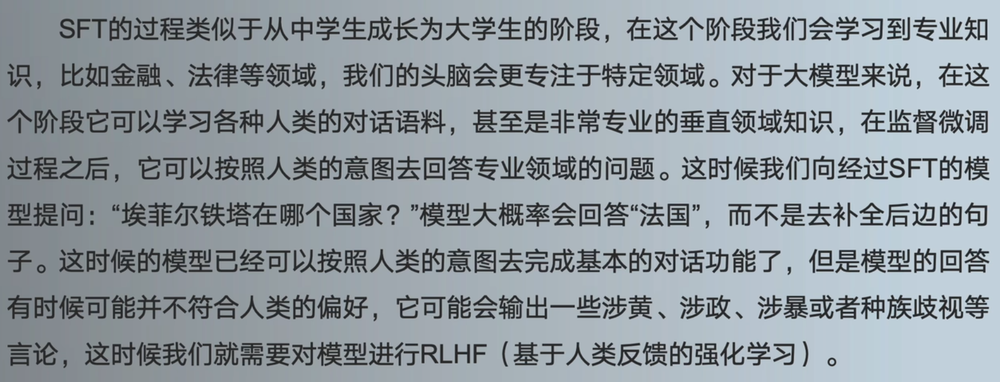

###### iii.RLHF（基于人类反馈的强化学习）

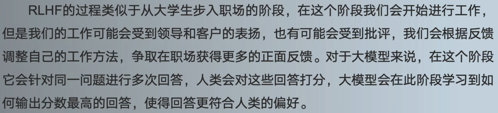

#### 4.大模型的特点与分类

##### Ⅰ.大模型的特点

###### i.规模和参数量大

大模型通过其庞大的规模（拥有从数亿到数千亿级别的参数量）来捕获复杂的数据模式，使得它们能够理解和生成极其丰富的信息

###### ii.适应性和灵活性强

模型具有很强的适应性和灵活性，能够通过微调（fine-tune）或少样本学习高效地迁移到各种下游任务，有很强的跨域能力

###### iii.广泛数据集的预训练

大模型使用大量多样化的数据进行预训练，以学习广泛的知识表示，能够掌握语言、图像等数据的通用特征

###### iv.计算资源需求大

巨大的模型规模带来了高昂的计算和资源需求，包括但不限于数据存储、训练时间、能量消耗和硬件设施

##### Ⅱ.大模型的分类

按照应用场景，大模型可以大致分为：大语言模式（LLM）和多模态模型（计算机视觉模型、音频处理模型等）

###### i.大语言模型（LLM）

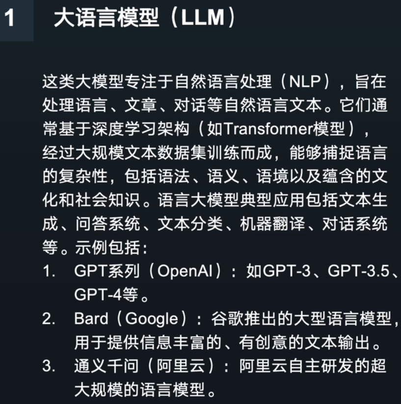

###### ii.多模态模型

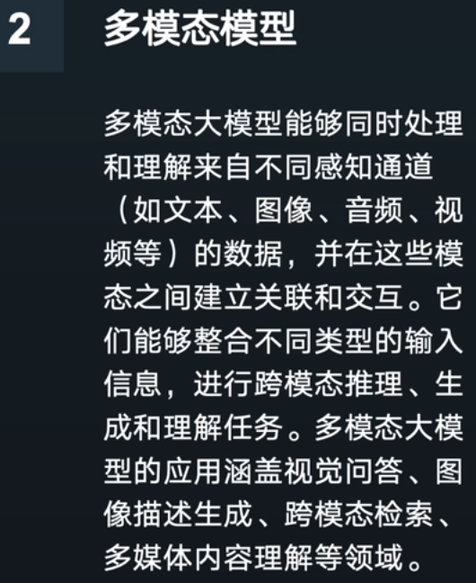

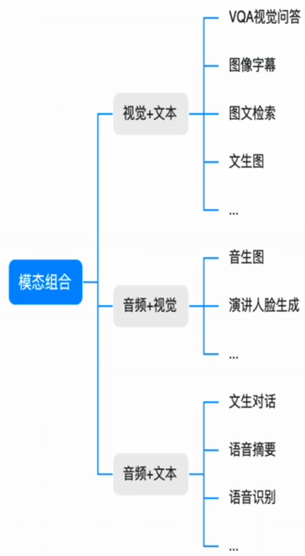

#### 5.大模型的工作流程

##### Ⅰ.分词化（Tokenization）与词表映射

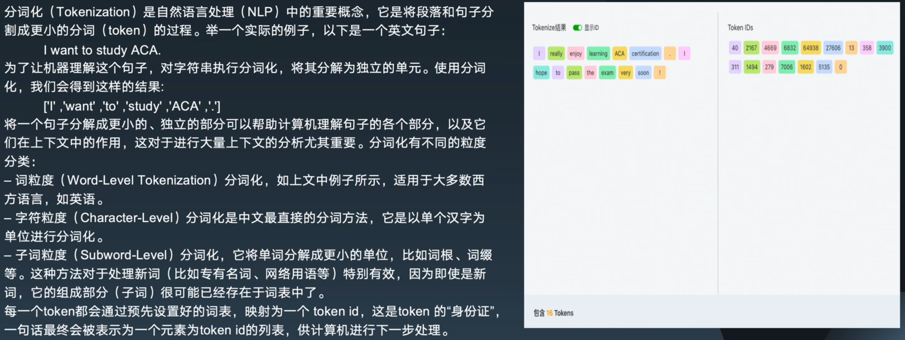

##### Ⅱ.文本生成过程

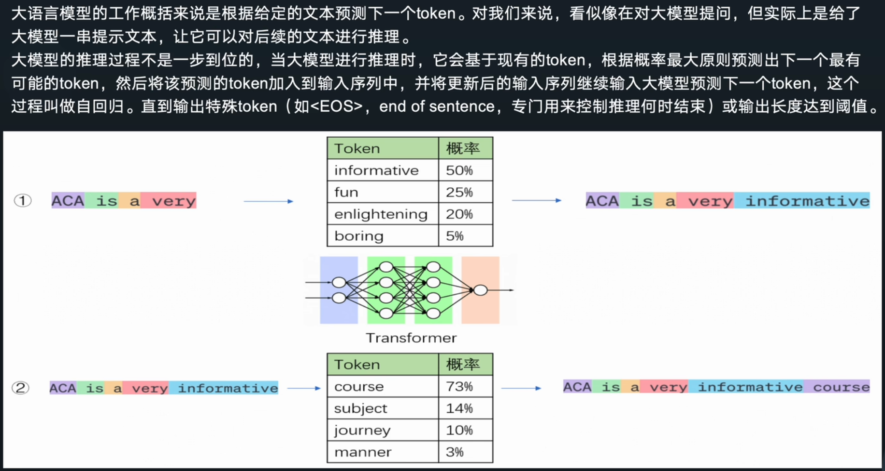

#### 6.大模型的应用

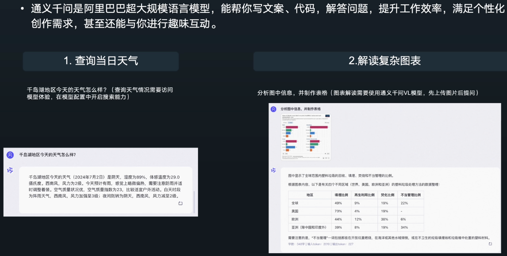

#### 7.知识库

存储知识和信息的系统，与LLM结合，使AI系统更好地利用本地知识来响应查询和执行任务

#### 8.Embeding

嵌入，又称向量化，矢量化。将文本数据转换为数值向量的过程

* 向量化表示

  数值向量捕捉到了文本项的语义和语法特征，使得计算机能够处理文本数据

* 维度降低

  通过embeding，可以将每个文本项表示为一个较低纬度的稠密向量，这些向量在较小的维度空间内保持了原始数据的重要特征

* 语义关系

  embeding向量能够编码语义信息，使得语义上相似的词汇在向量空间中彼此接近。因此在信息检索、文本分类、情感分析等任务中非常有效

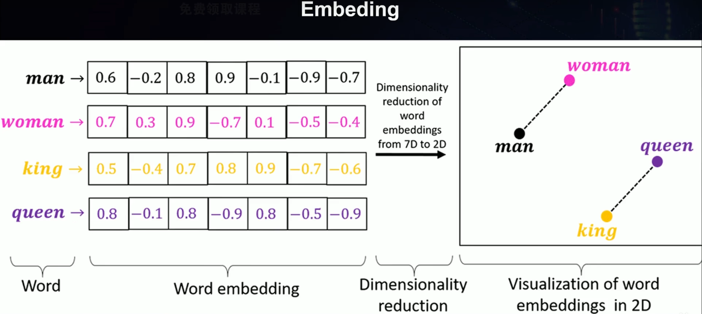

#### 9.提示词（Prompt）

提示词（prompt）是指在使用大模型时，向模型提供的一些指令或问题。这些指令作为模型的输入，引导模型产生所需要的输出。例如，在生成文本时，prompt可能是一个问题或者一个句子开始的部分，模型需要根据这个提示来生成接下来的内容

> 提示词存在的问题：
>
> 1. 模型自身问题：prompt存在的问题包括了准确性、相关性和偏见性。由于模型是根据训练数据来学习的，如果训练数据存在偏见或质量问题，那么模型生成的内容也可能收到这些问题的影响。此外，模型有时也会产生与提示不相关的内容，或者理解不准确，从而导致输出结果的质量下降
> 2. 使用者问题：缺乏系统性，依赖个人经验等

#### 10.提示词工程（Prompt engineer）

提示词工程（Prompt engineer）是指与LLM交互时，如何设计和优化输入语句，并引导其行为为期望的结果，而无需更新模型权重。其过程和机器学习的过程类似，都需要经过迭代的过程，直到满足场景

prompt构建的原则：

1. 清晰和明确的指令
2. 上下文的使用
3. 给模型思考的事件

* prompt结构

  * Context上下文（可选）

    1. 角色
    2. 任务
    3. 知识

    例如：你是一名机器学习工程师，负责开发一个文本分类模型，该模型可以将电影评论分为正面评价和负面评价两类

  * Instruction命令（必选）

    1. 步骤
    2. 思维链
    3. 示例

    例如：请根据一下上下文和输入，对文本进行分类，并给出响应的输出类别

  * input data输入数据（必选）

    1. 句子
    2. 文章
    3. 问题

    例如：

    输入文本：这部电影太精彩了！演员表现出色，剧情扣人心弦，强烈推荐！

    输出类别：正面评价

  * output indicator输出格式（可选）

* 示例

  业务一：

  某智能音响，希望用大模型代替传统自然语言处理模型，可以从用户输入内容中提取出结构化信息

  业务要求：

  * 格式规范：大模型输出的内容要直接给到后端服务接口使用，所以大模型一定要按照固定格式输出，以便于接口解析模型输出内容，防止报错
  * 字段枚举：部分字段的提取内容需要是枚举值，例如目的、事件类型等

  prompt设计的结构：

  * 用户输入：将用户输入的内容拼接到prompt中，提交给大模型
  * 身份定义：定义大模型扮演角色，帮助大模型理解指令
  * 背景说明：明确对话发生的背景信息，帮助大模型理解指令
  * 字段说明：说明要提取的字段的含义，以及字段存在的枚举值
  * 输出示例：输出内容示例

  prompt：

  你是一个智能助理，你需要帮用户结构化记录生日信息、物品存放信息、月经信息

  用户输入是一句非常口语化的指令，你需要记录用户指令，并从用户的指令中结构化的输出提取出信息

  输出完毕后结束，不要生成新的用户输入，不要新增内容

  1. 提取话题，话题只能是：生日、纪念日、月经、物品存放
  2. 提取目的：目的只能是：记录、预测、查询、庆祝、设置、记录物品、拿到物品、寻找、删除、修改
  3. 提取人物：人物指的是：过生日的任务、过纪念日的人物、来月经的人物、放物品的人物。输出只能是：我、爸爸、妈妈、孩子、爱人、恋人、朋友、哥哥、姐姐。没有写“无”
  4. 提取人物关系，关系指人物与用户的关系，只能是：本人、亲人、配偶、朋友、未知、待查询。没有写“无”
  5. 提取时间，比如：今天、3月1日、上个月、农历二月初六、待查询。没有写“无”
  6. 提取时间类型，时间类型只能是：过生日的时间、过纪念日的时间、月经开始时间、月经结束时间。没有写“无”
  7. 提取物品，比如：衣服、鞋子、书、电子产品、其它
  8. 提取物品对应位置：比如：衣柜、书柜、鞋柜、电子产品柜，待查询
  9. 按示例结构输出内容，结束

* 归纳：

  * 流程简单：过于复杂的流程会增加大模型出错概率，应该尽量减少流程
  * 理解语义：必须要强烈的语气来告诉大模型要干什么
  * 多肯定：多用肯定句，告诉大模型要做什么，不是限制大模型不做什么
  * 结合功能：要结合功能流程设计prompt，不能期望一次与大模型的交互解决一切问题

#### 11.RAG（检索增强生成）

RAG融合了信息检索和文本生成两种技术，先从大数据中检索信息，再基于这些信息生成文本。RAG旨在提高文本生成的相关性、准确性和深度，特别适用于需要广泛知识和深度理解的复杂查询

#### 12.Finetuning（微调）

对预训练的人工智能模型进行进一步训练，以便更好地适应特定的任务或数据集。通过使用特定领域或任务的数据，微调模型的参数，使其更适合于该特定环境，比如提升精度，减少错误率或提高处理速度

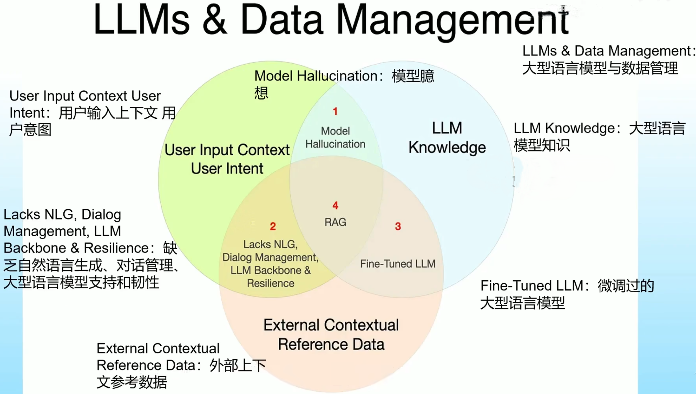

#### 13.AI应用流程

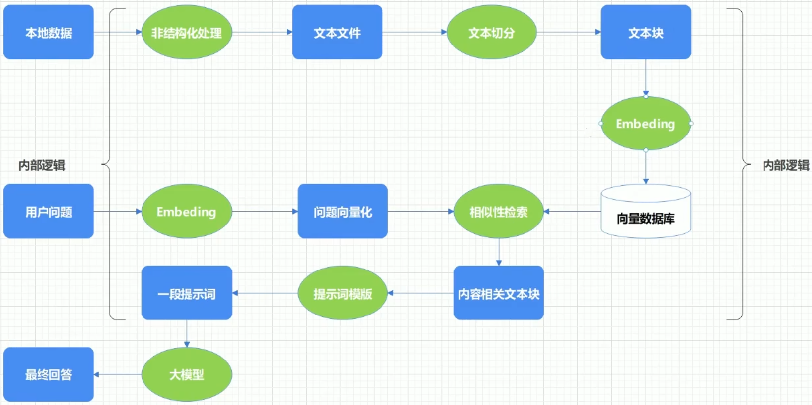

### 二、进阶

#### 1.AI Agent概念、组成与决策

* AI Agent

  大预言模型可以接受输入，可以分析推理，输出文字、代码、媒体。然而无法像人类一样拥有规划思考能力、运用各种工具与物理世界互动，以及拥有人类的记忆能力

  AI Agents是基于LLM的能够自主理解、自主规划决策、执行复杂任务的智能体

  Agent的设计目的是为了处理那些简单的语言模型可能无法直接解决的问题，尤其是当任务涉及到多个步骤或者需要外部数据源的情况

* LLM：接受输入、思考、输出

* 人类：LLM（接受输入、思考、输出）+记忆+工具+规划-->Agents

* Agents流程图

  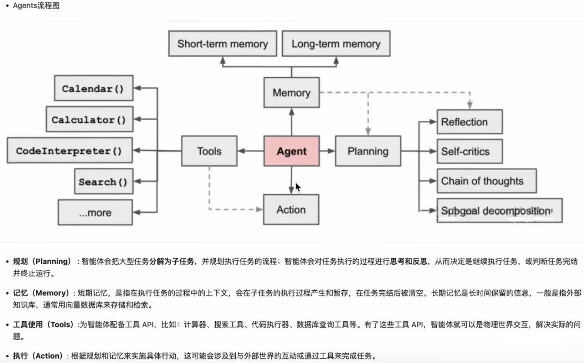

  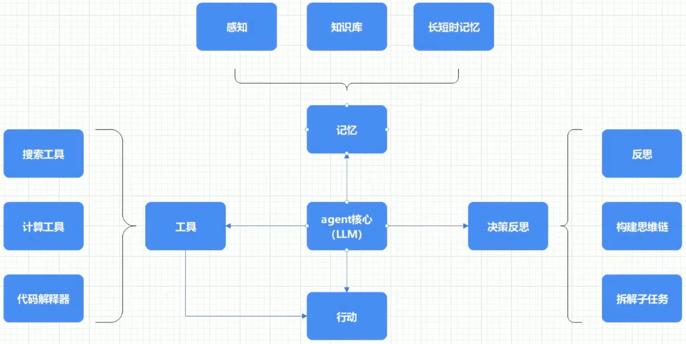

* Agents决策流程图

  Agents决策流程，一个循环一个Task

  ```mermaid
  graph LR
  1[感知（perception）]-->2[规划（planning）]
  2-->3[行动（action）]
  3-->4[观察（observation）]
  4-->1
  ```

#### 2.Agent应用场景分析

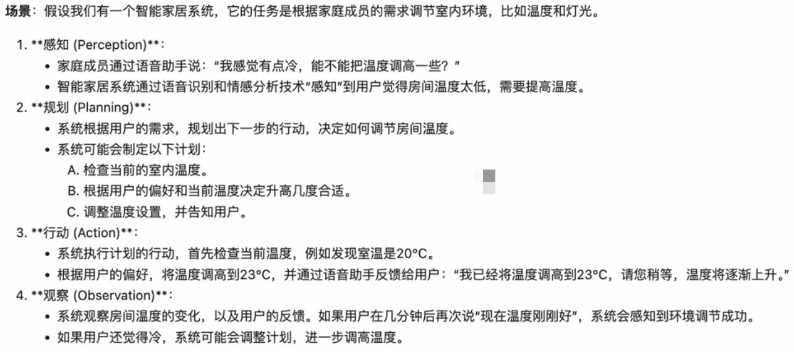

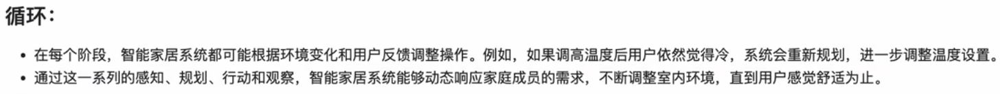

#### 3.Agent规划（Planning）

##### Ⅰ.子任务拆解

通过LLM使得智能体可以把大型任务分解为更小的、更可控的子任务，从而能够有效完成复杂的任务

* 思维链（Chain of Thoughts，COT）

  比较标准的提示技术，能显著提升LLM完成复杂任务的效果，把问题分解成多个步骤，一步一步思考和解决，是一种线性的思维方式

* 思维树（Tree of Thoughts，TOT）

  对思维链的进一步扩展，在思维链的每一步，推理出多个分支，拓扑展开成一颗思维树。使用启发式方法评估每个推理分支对问题解决的贡献。选择搜索算法，使用广度优先搜索（BFS）或深度优先搜索（DFS）等算法来探索思维树，并进行前瞻和回溯

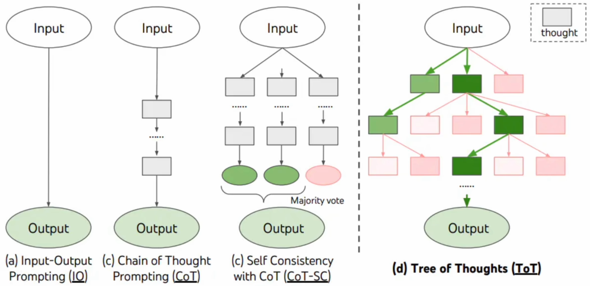

##### Ⅱ.反思与改进

Agent对过去的行动进行自我批判和反思，从错误中学习并改进未来的步骤，从而提高最终结果的质量

在实际任务中，试错是不可避免的，而自我反思在这个过程中起着至关重要的作用。它允许Agent通过改进过去的行动决策和纠正以前的错误来进行迭代改进

反思是Agent对事情进行更高层次、更抽象思考的结果。反思是周期性生成的，当Agent感知到的最新事件的重要性评分之和超过一定阈值时，就会生成反思

#### 4.Agent记忆（Memory）

智能体中的记忆机制：

1. 形成记忆：大模型在大量包含世界知识的数据集上进行预训练。在预训练中，大模型通过调整神经元的权重来学习和生成人类语言，这可以被视为“记忆”的形成过程。通过使用深度学习和梯度下降等技术，大模型可以不断提高基于预测或生产文本的能力，进而形成世界记忆或长期记忆
2. 短期记忆：在当前任务执行过程中所产生的信息，比如某个工具或某个子任务执行的结果，会写入短期记忆中。记忆在当前任务过程中产生和暂存，在任务完结后被清空
3. 长期记忆：长时间保留的信息，一般是指外部知识库，通常用向量数据库来存储和检索

#### 5.Agent工具（Tools/Toolkits）

Agent可以通过学习调用外部API来获取模型权重中所缺少的额外信息，这些信息包括当前信息、代码执行能力和访问专有信息源等。这对于预训练后难以修改的模型权重来说是非常重要的。为大语言模型（LLM）提供外部工具来提升其能力

#### 6.Agent框架

* Plan-and-Execute

  计划与执行（Plan-and-Execute）框架侧重于先规划一系列的行动，然后执行。这个框架可以使大模型能够先综合考虑任务的多个方面，然后按照计划进行行动。在复杂的项目管理中或者需要多步决策的场景下比较适合

* Self-Ask

  自问自答（Self-Ask）框架这个允许大模型对自己提出问题并回答，来增强问题的理解以提高回答质量，适合需要深入分析或者提供创造性解决方案的场景

* Thinking and Self-Refection

  思考并自我反思（Thinking and Self-Refection）框架主要用于模拟和实现复杂决策过程，通过不断自我评估和调整，使系统能够学习并改进决策过程，从而在面对复杂问题时作出更加有效的决策

* ReAct（Reason + Act）

  《ReAct: Synergizing Reasoning and Acting in Language Models》这篇论文提出一种增强大型语言模型的方法，它通过结合推理（Reasoning）和行动（Acting）来增强推理和决策的效果

  参考：https://react-lm.github.io/

  重点分析：

  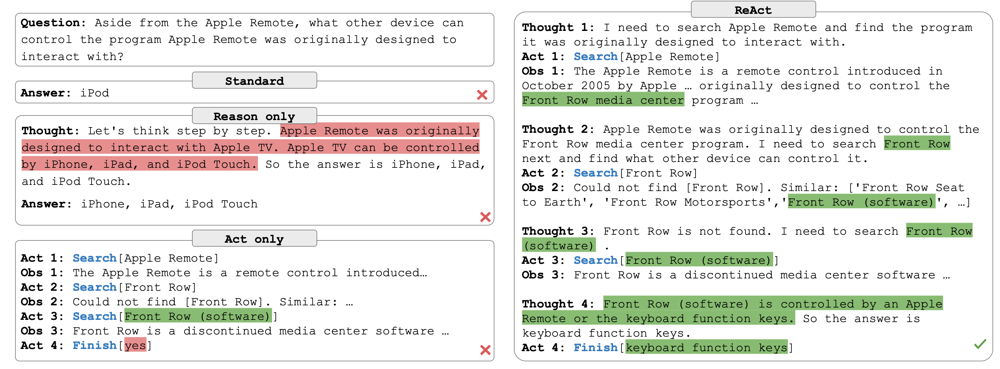

  * 标准（Standard）：

    直接给出错误答案——iPod，没有提供任何推理过程或外部交互，直接给出答案

    错误的答案：iPod

  * 仅推理（Reason only）：

    尝试通过逐步推理来解决问题，但没有与外部环境交互来验证信息，错误地推断出答案是iPhone、iPad和iPod Touch

    错误的答案：iPhone、iPad和iPod Touch

  * 仅行动（Act only）：

    通过与外部环境（如维基百科）的一系列交互来获取信息，尝试多次搜索（搜索“Apple Remote”，“Front Row”等），但缺乏推理支持，未能综合这些观察结果后得出正确答案，认为需要结束搜索

    错误的决策：结束搜索

  * ReAct：

    组合推理和行动，首先通过推理确定搜索Apple Remote（苹果遥控器），并从外部环境中观察结果，随着推理的深入，识别出需要搜索Front Row（软件），在几轮交互后，通过进一步推理，准确得出答案“键盘功能键”

    正确的答案：键盘功能键

  为什么结合推理和行动，能有效增强LLM完成任务的能力？

  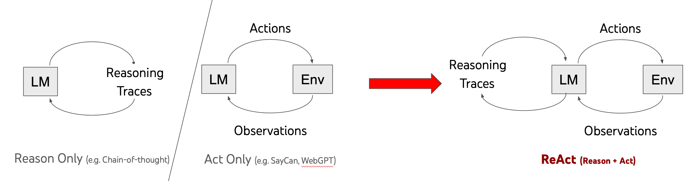

  * 仅推理（Reason Only）：LLM仅仅基于已有的只是进行推理，生成答案回答这个问题，很显然，如果LLM本身不具备这些知识，可能会出现幻觉，胡乱作答
  * 仅行动（Act Only）：LLM不加以推理，仅使用工具（比如搜索引擎）搜索这个问题，得出来的将会是海量的资料，不能直接回答这个问题
  * 推理+行动（Reason + Act）：LLM首先会基于已有的知识，并审视拥有的工具，当发现已有的知识不足以回答这个问题，则会调用工具，比如：搜索工具、生成报告等，然后得到新的信息，基于新的信息进行推理和行动，直到完成这个任务

#### 7.Semantic Kernel

微软开源的轻量级的SDK，用于生成AI Agent并将AI模型集成到C#、Python或Java代码库中，它充当一个高效的中间件，可实现企业级解决方案的快速交付

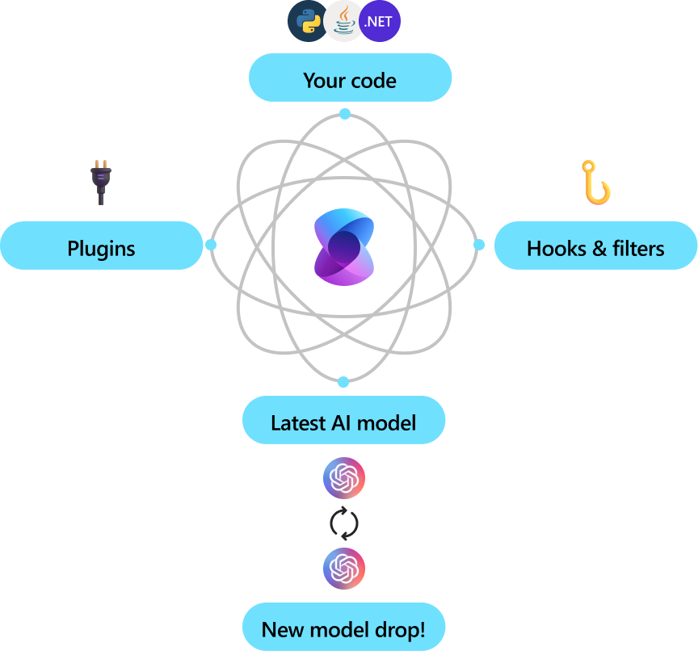

> Semantic Kernel框架与原生http调用区别：
>
> 1. 开发效率对比：
>
>    | 对比项     | Semantic Kernel                              | 原生http                                 |
>    | ---------- | -------------------------------------------- | ---------------------------------------- |
>    | 代码复杂度 | 高层抽象，只需关注业务逻辑（如提示词、插件） | 需手动构造http请求、处理响应、解析JSON   |
>    | 发送请求   | `kernel.InvokePromptAsync("你好")`           | 需编写HttpClient代码+代理API签名/认证    |
>    | 错误处理   | 内置异常封装（如`SKException`）              | 需自行处理网络错误、速率限制、模型错误等 |
>
> 2. 功能集成对比：
>
>    | 对比项       | Semantic Kernel                            | 原生http                        |
>    | ------------ | ------------------------------------------ | ------------------------------- |
>    | 插件系统     | ✔支持插件（Plugins），可复用函数和语义技能 | ✘需自行实现模块化               |
>    | 模板引擎     | ✔内置模板（如`{{$input}}`）和变量替换      | ✘需手动拼接字符串或使用第三方库 |
>    | 多模型支持   | ✔统一接口切换模型（如OpenAI⟷国产模型）     | ✘需为不同模型编写适配代码       |
>    | 对话历史管理 | ✔自动维护`ChatHistory`上下文               | ✘需自行维护消息列表             |
>
> 3. 扩展性与进阶功能
>
>    | 对比项              | Semantic Kernel                 | 原生http                               |
>    | ------------------- | ------------------------------- | -------------------------------------- |
>    | Agents（代理）      | ✔支持创建多角色Agent协作系统    | ✘需完全自行实现                        |
>    | Planner（任务规划） | ✔可自动分解复杂任务为步骤       | ✘需手动设计流程                        |
>    | Memory（记忆）      | ✔内置向量存储和上下文记忆       | ✘需集成外部数据库（如Redis、PGVector） |
>    | 本地模型支持        | ✔兼容Ollama、LMStudio等本地模型 | ✘需自行封装本地API接口                 |

将源码[microsoft/semantic-kernel](https://github.com/microsoft/semantic-kernel)拉取下来，框架如下：

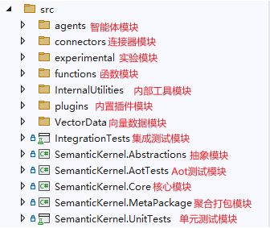

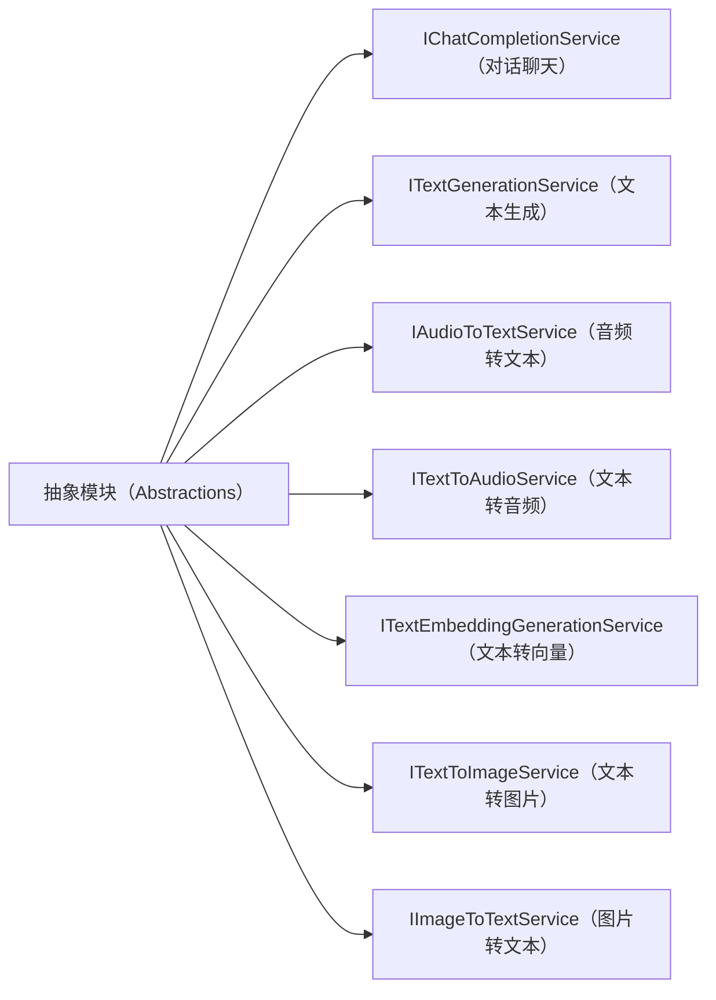
```mermaid
graph LR
1[抽象模块（Abstractions）]-->1.1[IChatCompletionService（对话聊天）]
1-->1.2[ITextGenerationService（文本生成）]
1-->1.3[IAudioToTextService（音频转文本）]
1-->1.4[ITextToAudioService（文本转音频）]
1-->1.5[ITextEmbeddingGenerationService（文本转向量）]
1-->1.6[ITextToImageService（文本转图片）]
1-->1.7[IImageToTextService（图片转文本）]
```

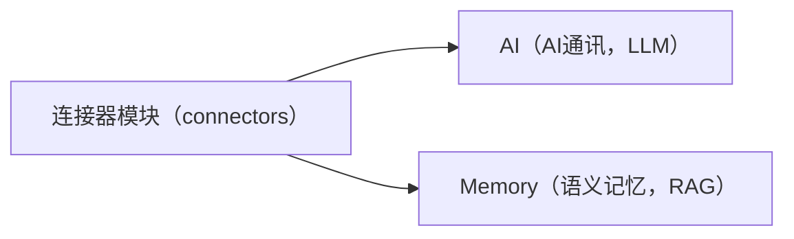
```mermaid
graph LR
1[连接器模块（connectors）]-->1.1[AI（AI通讯，LLM）]
1-->1.2[Memory（语义记忆，RAG）]
```

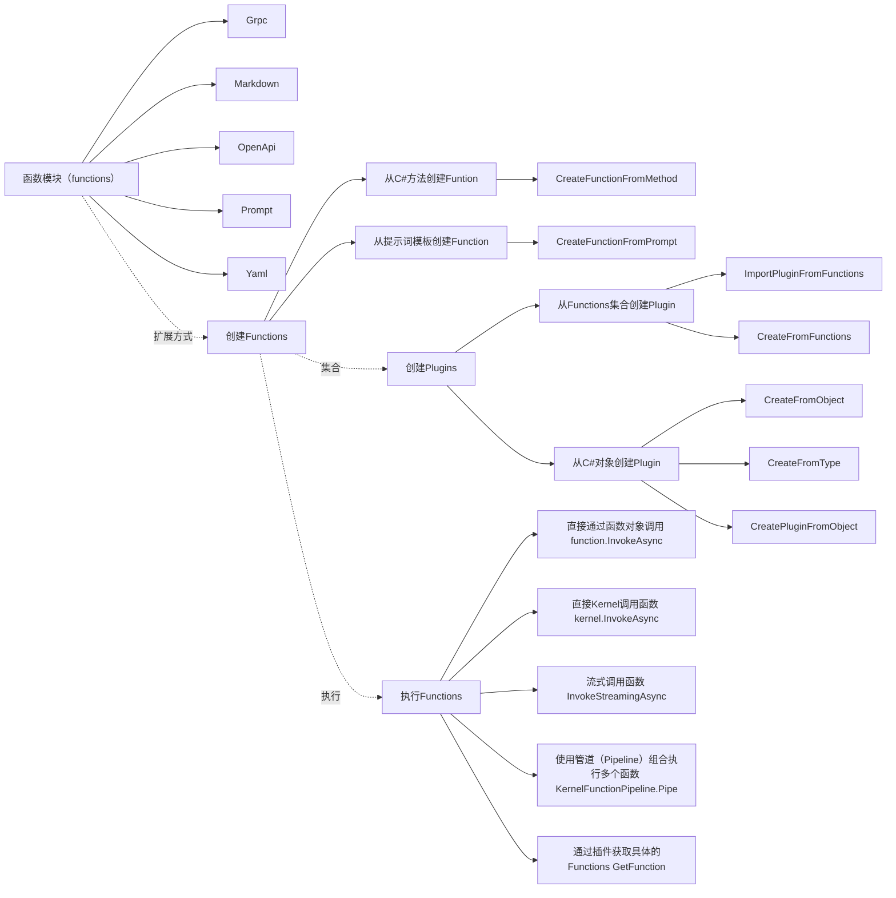
```mermaid
graph LR
1[函数模块（functions）]-->1.1[Grpc]
1-->1.2[Markdown]
1-->1.3[OpenApi]
1-->1.4[Prompt]
1-->1.5[Yaml]
1-.->|扩展方式|1.6[创建Functions]
1.6-->1.6.1[从C#方法创建Funtion]
1.6-->1.6.2[从提示词模板创建Function]
1.6-.->|集合|1.6.3[创建Plugins]
1.6-.->|执行|1.6.4[执行Functions]
1.6.1-->1.6.1.1[CreateFunctionFromMethod]
1.6.2-->1.6.1.2[CreateFunctionFromPrompt]
1.6.3-->1.6.3.1[从Functions集合创建Plugin]
1.6.3-->1.6.3.2[从C#对象创建Plugin]
1.6.4-->1.6.4.1[直接通过函数对象调用 function.InvokeAsync]
1.6.4-->1.6.4.2[直接Kernel调用函数 kernel.InvokeAsync]
1.6.4-->1.6.4.3[流式调用函数 InvokeStreamingAsync]
1.6.4-->1.6.4.4[使用管道（Pipeline）组合执行多个函数 KernelFunctionPipeline.Pipe]
1.6.4-->1.6.4.5[通过插件获取具体的Functions GetFunction]
1.6.3.1-->1.6.3.1.1[ImportPluginFromFunctions]
1.6.3.1-->1.6.3.1.2[CreateFromFunctions]
1.6.3.2-->1.6.3.2.1[CreateFromObject]
1.6.3.2-->1.6.3.2.2[CreateFromType]
1.6.3.2-->1.6.3.2.3[CreatePluginFromObject]
```

