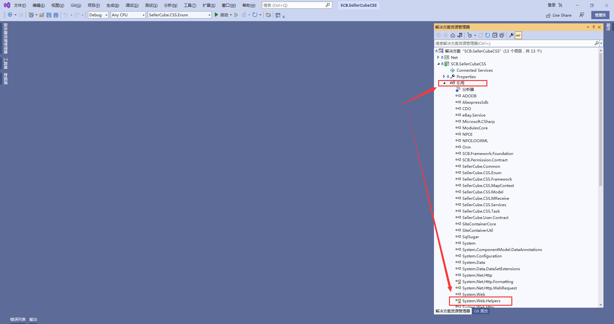
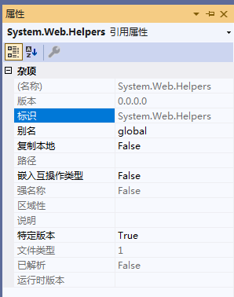
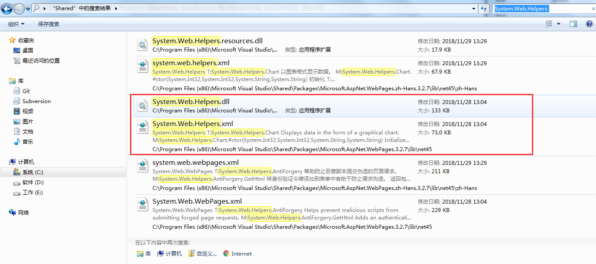
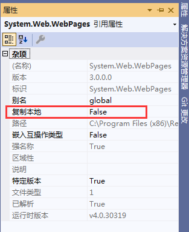

## 一、基础知识点

### 1..NetCore、.NetFramework、.NetStandard区别

分别新建.NetCore控制台和.NetFramework控制台，并执行

```c#
Console.WriteLine(typeof(FileStream).Assembly.Location);
```

可以看到分别输出

``` 
C:\Program Files\dotnet\shared\Microsoft.NETCore.App\6.0.4\System.Private.CoreLib.dll
```

``` 
C:\Windows\Microsoft.NET\Framework\v4.0.30319\mscorlib.dll
```

再新建一个.NetStandard类库，编写同样代码，并于.NetCore控制台和.NetFramework控制台中引用执行，发现结果如上一致

其中FileStream的程序集引用路径

.NetCore：

```
C:\Users\LWB\.nuget\packages\netstandard.library\2.0.3\build\netstandard2.0\ref\netstandard.dll
```

.NetFramework：

```
C:\Program Files (x86)\Reference Assemblies\Microsoft\Framework\.NETFramework\v4.8\mscorlib.dll
```

.NetStandard：

```
C:\Users\LWB\.nuget\packages\netstandard.library\2.0.3\build\netstandard2.0\ref\netstandard.dll
```

根据结果可得出结论，对同一个类名，.NetCore和.NetFramework分别做出了不同的实现，它们来自不同的程序集。而.NetStandard只是标准规范不是实现，它可以被.NetCore、.NetFramework、Xamarin等引用，并根据引用框架再进行实现。因此若需要编写一个公共的类库，尽量使用.NetStandard，并且尽量使用低版本

csproj文件，程序集下的类，.NetFramework使用的是包含，而.NetCore使用的是排除

### 2.集成开发环境

IDE可选用如下：

* .Net CLI(命令行)
* Visual Studio
* Jetbrains Rider(收费)
* Visual Studio Code

### 3.async/await

* 异步方法的返回值一般是Task<T>，T是真正的返回值类型。一般惯例异步方法命名以Async结尾
* 即使方法没有返回值，也最好把返回值声明为非泛型的Task
* 不支持异步方法，可用GetAwaiter().GetResult()，但是有死锁风险，不建议用
* 对于无需用到异步方法结果，只将其结果作为返回值返回时，可以不使用async/await而直接返回Task<T>，从而减少语法糖的使用，提高性能
* 异步方法中暂停，使用await Task.Delay()

委托中使用async\await语法示例

```c#
ThreadPool.QueueUserWorkItem(async (obj) =>
{
    await Task.CompletedTask;
});
```

本质：

* async/await是语法糖，async的方法最终编译成一个类，根据await调用切分为多个状态，对async的调用会被拆分为对MoveNext的调用，类似于状态机的调用，当遇到await，则主线程return返回。
* await调用的等待期间，框架会把当前的线程返回给线程池，等异步方法调用执行完毕后，框架会从线程池再取一个出来执行后续的代码
* 可通过Thread.CurrentThread.ManagedThreadId打印当前线程来验证，分别打印主线程，await方法内线程，await方法后线程的Id
* 异步方法的代码并不会自动在新线程中执行，除非把代码放到新线程中执行
* 具体可以反编译到c#4.0或以下看到实现代码。

缺点：

* 异步方法会生成一个类，运行效率没有普通方法高

* 可能会占用非常多的线程

其他：

* 接口方法或抽象方法不能修饰为async

### 4.yield

yield关键字属于语法糖，使用它可以让代码具有更高可读性和更好性能，当我们需要返回IEnumerable类型的时候，直接yield返回数据就可以了

```c#
public IEnumerable<int> YieldDemo()
{
    int[] array = { 1, 2, 3, 4, 5 };
    foreach (int i in array)
    {
        if (i == 4)
            yield break;
        yield return i;
    }

    yield return 6;
    yield return 7;
}
```

async方法中使用yield，返回值声明为IAsyncEnumerable<T>而非Task<T>，遍历时则使用await foreach

```c#
static async Task Main(string[] args)
{
    await foreach (var y in YieldDemoAsync())
        Console.WriteLine(y);
}

static async IAsyncEnumerable<int> YieldDemoAsync()
{
    int[] array = { 1, 2, 3, 4, 5 };
    foreach (int i in array)
    {
        if (i == 4)
            yield break;
        yield return i;
    }

    yield return 6;
    yield return 7;
}
```


### 5.CancellationTokenSource

CancellationTokenSource对象通过其 Token 属性提供取消令牌，并通过调用取消 Cancel 消息或 CancelAfter方法发送取消消息，对象实现 [IDisposable](https://docs.microsoft.com/zh-cn/dotnet/api/system.idisposable?view=net-6.0) 接口，使用完该类型的实例后，应直接或间接释放它。CancellationToken对象，指示是否请求取消

```c#
static async Task Main(string[] args)
{
    using CancellationTokenSource cts = new CancellationTokenSource();
    cts.CancelAfter(3 * 1000);

    await Task.Run(async() =>
    {
        int i = 0;
        while (!cts.IsCancellationRequested)
        {
            Console.WriteLine($"{++i}");
            await Task.Delay(1 * 1000);
        }
        Console.WriteLine("退出");
    });
}
```

### 6.框架定义特性

* Conditional

```c#
#define UseDemo//宏, 被定义时, 特性标记为[Conditional("UseDemo")]的方法才会执行, 其中特性参数conditionString需要和宏的命名一致
using System.Diagnostics;

namespace Demo
{
    internal class Program
    {
        static void Main(string[] args)
        {
            Demo();
            Console.ReadLine();
        }
        [Conditional("UseDemo")]
        static void Demo()
        {
            Console.WriteLine("Demo() has been executed.");
        }
    }
}
```

* CallerFilePath、CallerMemberName、CallerLineNumber

```c#
static void Main(string[] args)
{
    Printf();
    Console.ReadLine();
}
/// <summary>
/// 打印调用方信息
/// </summary>
/// <param name="callerFilePath">调用方源代码所在文件路径</param>
/// <param name="callerMemberName">调用方成员名称,方法名或者属性名</param>
/// <param name="callerLineNumber">调用方所在源代码的行数</param>
static void Printf([CallerFilePath] string callerFilePath = "", [CallerMemberName] string callerMemberName = "", [CallerLineNumber] int callerLineNumber = 0)
{
    Console.WriteLine($"CallerFilePath:{callerFilePath}, CallerMemberName:{callerMemberName}, CallerLineNumber:{callerLineNumber}");
}
```

### 7.依赖注入

依赖注入(Dependency Injection, DI)是控制反转(Inversion Of Control, IOC)思想的实现方式。简化模块的组装过程，降低模块之间的耦合度。

相关概念：

* 服务容器，负责管理注册的服务
* 服务，已注册的对象
* 对象生命周期，瞬态(Transient)，范围(Scoped)，单例(Singleton)

使用：

引用nuget包：Microsoft.Extensions.DependencyInjection

```c#
using Microsoft.Extensions.DependencyInjection;

namespace Demo
{
    internal class Program
    {
        static void Main(string[] args)
        {
            ServiceCollection services = new ServiceCollection();
            services.AddScoped(typeof(Test));//注册服务

            IServiceProvider serviceProvider = services.BuildServiceProvider();
            var test = serviceProvider.GetService<Test>();//获取服务
            test?.Printf();

            Console.ReadLine();
        }
    }

    internal class Test
    {
        public void Printf() => Console.WriteLine($"{nameof(Printf)} Invoke");
    }
}
```

生命周期：

* 如果一个类实现了IDisposable接口，则离开作用域之后容器会自动调用对象的Dispose方法

* 不要在长生命周期的对象中引用比它短的生命周期的对象，在Asp.Net Core中，这样做默认会抛异常

* 选择：如果类无状态，建议为Singleton；如果类有状态，且有Scope控制，建议为Scope，通常有Scope控制下的代码都是运行在同一个线程中，没有并发修改问题；而使用Transient则要谨慎

各生命周期示例如下：

```c#
internal class Program
{
    static void Main(string[] args)
    {
        ServiceCollection services = new ServiceCollection();
        services.AddSingleton<SingletonTest>();
        services.AddScoped<ScopeTest>();
        services.AddTransient<TransientTest>();

        IServiceProvider serviceProvider = services.BuildServiceProvider();

        //Scope1
        using (var scope1 = serviceProvider.CreateScope())
        {
            Console.WriteLine("This is scope1.");
            var singletonTest1 = scope1.ServiceProvider.GetService<SingletonTest>();
            var scopeTest1 = scope1.ServiceProvider.GetService<ScopeTest>();
            var transientTest1 = scope1.ServiceProvider.GetService<TransientTest>();
        }

        //Scope2
        using (var scope2 = serviceProvider.CreateScope())
        {
            Console.WriteLine("This is scope2.");
            var singletonTest2 = scope2.ServiceProvider.GetService<SingletonTest>();
            var scopeTest2 = scope2.ServiceProvider.GetService<ScopeTest>();
            var transientTest2 = scope2.ServiceProvider.GetService<TransientTest>();
        }

        Console.ReadLine();
    }
}
internal class SingletonTest : IDisposable
{
    public SingletonTest() => Console.WriteLine($"{nameof(SingletonTest)} has been constructed.");
    public void Dispose() => Console.WriteLine($"{nameof(SingletonTest)} has been released.");
}
internal class ScopeTest : IDisposable
{
    public ScopeTest() => Console.WriteLine($"{nameof(ScopeTest)} has been constructed.");
    public void Dispose() => Console.WriteLine($"{nameof(ScopeTest)} has been released.");
}
internal class TransientTest : IDisposable
{
    public TransientTest() => Console.WriteLine($"{nameof(TransientTest)} has been constructed.");
    public void Dispose() => Console.WriteLine($"{nameof(TransientTest)} has been released.");
}
```

IServiceProvider服务定位器方法：

* T? GetService<T>如果获取不到对象，则返回null
* T GetRequiredService<T>如果获取不到对象，则抛异常
* IEnumerable<T> GetServices<T>获取多个满足条件的服务

### 8.配置(结合IOptions)

引用nuget包：Microsoft.Extensions.Configuration和Microsoft.Extensions.Configuration.Json

* 原始方法

```c#
static void Main(string[] args)
{
    IConfigurationBuilder configurationBuilder = new ConfigurationBuilder();
    configurationBuilder.AddJsonFile("config.json", optional: false, reloadOnChange: true);

    IConfigurationRoot configurationRoot = configurationBuilder.Build();
    var str1 = configurationRoot["str1"];
    var str2 = configurationRoot.GetSection("str2:value").Value;

    Console.ReadLine();
}
```

* 配置绑定到类

引用nuget包：Microsoft.Extensions.Configuration.Binder

```c#
internal class Program
{
    static void Main(string[] args)
    {
        IConfigurationBuilder configurationBuilder = new ConfigurationBuilder();
        configurationBuilder.AddJsonFile("config.json", optional: false, reloadOnChange: true);

        IConfigurationRoot configurationRoot = configurationBuilder.Build();
        ConfigObj str2 = configurationRoot.GetSection("str2").Get<ConfigObj>();

        Console.ReadLine();
    }
}
internal class ConfigObj
{
    public string value { get; set; }
}
```

* 选项方式(推荐)，结合依赖注入：

引用nuget包：Microsoft.Extensions.Options

```c#
namespace Demo
{
    internal class Program
    {
        static void Main(string[] args)
        {
            IConfigurationBuilder configurationBuilder = new ConfigurationBuilder();
            configurationBuilder.AddJsonFile("config.json", optional: false, reloadOnChange: true);

            IConfigurationRoot configurationRoot = configurationBuilder.Build();

            IServiceCollection services = new ServiceCollection();
            services.AddScoped<Obj>();
            services.AddOptions().Configure<ConfigObj>(e => configurationRoot.GetSection("str2").Bind(e));
            IServiceProvider serviceProvider = services.BuildServiceProvider();

            using var scope = serviceProvider.CreateScope();
            Obj obj = scope.ServiceProvider.GetService<Obj>();

            Console.ReadLine();
        }
    }
    internal class ConfigObj
    {
        public string value { get; set; }
    }
    internal class Obj
    {
        public Obj(IOptionsSnapshot<ConfigObj> options)
        {
            Console.WriteLine($"{nameof(Obj)} has been constructed. options:{System.Text.Json.JsonSerializer.Serialize(options.Value)}");
        }
    }
}
```

当应用运行中修改配置文件时，IOptions不会读取到新的值；IOptionsMonitor会在配置改变时马上读取新的值；IOptionsSnapshot会在一个范围内(比如Asp.Net Core同一个请求中)保持一致，建议使用

* 命令行配置

引用nuget包：Microsoft.Extensions.Configuration.CommandLine

```c#
static void Main(string[] args)
{
    IConfigurationBuilder configurationBuilder = new ConfigurationBuilder();
    configurationBuilder.AddCommandLine(args);

    IConfigurationRoot configurationRoot = configurationBuilder.Build();
    var conn = configurationRoot.GetSection("conn").Value;

    Console.WriteLine($"Conn:{conn}");

    Console.ReadLine();
}
```

使用命令行执行exe时，传入参数则可，支持多种格式，比如conn=127.0.01，--conn=127.0.0.1，--conn 127.0.0.1，/conn=127.0.0.1，/conn 127.0.0.1，注意键值之间加空格，格式不要混用

* 环境变量配置

引用nuget包：Microsoft.Extensions.Configuration.EnvironmentVariables

```c#
static void Main(string[] args)
{
    IConfigurationBuilder configurationBuilder = new ConfigurationBuilder();
    configurationBuilder.AddEnvironmentVariables();//configurationBuilder.AddEnvironmentVariables("prefix");//匹配前缀

    IConfigurationRoot configurationRoot = configurationBuilder.Build();
    var environmentVariables = configurationRoot.AsEnumerable();

    foreach (var e in environmentVariables)
        Console.WriteLine($@"{e.Key}:{e.Value}");

    Console.ReadLine();
}
```

由于有可能和系统中的环境变量命名冲突，因此建议用有prefix参数的AddEnvironmentVariables方法，读取配置时prefix参数会被忽略

* 自定义读取配置
  * IConfigurationProvider
  
    开发一个直接或间接实现IConfigurationProvider接口的类XXXConfigurationProvider，一般继承自ConfigurationProvider。框架已有ConfigurationProvider派生出两个抽象类：1.FileConfigurationProvider，从文件读取时可使用，重写Load方法，2.StreamConfigurationProvider，从流对象读取时可使用，重写Load方法
    
  * IConfigurationSource
    
    再开发一个实现了IConfigurationSource接口的类XXXConfigurationSource，框架已有1.FileConfigurationSource，从文件读取时可使用，重写Build方法，需注意在方法内返回IConfigurationProvider前最好调用一下EnsureDefaults方法，作用是当用户没有提供IFileProvider时能提供一个默认值，2.StreamConfigurationSource，从流对象读取时使用，包括内存流、文件流、网络流等，重写Build方法
    
  

以上可以看出，FileConfigurationProvider和FileConfigurationSource，StreamConfigurationProvider和StreamConfigurationSource是属于配套使用。

读取txt文件作为配置示例：

```c#
internal class Program
{
    static void Main(string[] args)
    {
        IConfigurationBuilder configurationBuilder = new ConfigurationBuilder();
        configurationBuilder.AddTxtFile("config.txt", false, true);

        IConfigurationRoot configurationRoot = configurationBuilder.Build();
        var csvVariables = configurationRoot.AsEnumerable();

        foreach (var e in csvVariables)
            Console.WriteLine($@"{e.Key}:{e.Value}");

        Console.ReadLine();
    }
}
public class TxtConfigurationSource : FileConfigurationSource
{
    public override IConfigurationProvider Build(IConfigurationBuilder builder)
    {
        EnsureDefaults(builder);
        return new TxtConfigurationProvider(this);
    }
}
public class TxtConfigurationProvider : FileConfigurationProvider
{
    public TxtConfigurationProvider(FileConfigurationSource source) : base(source)
    {
    }

    public override void Load(Stream stream)
    {
        using StreamReader streamReader = new StreamReader(stream);
        string strLine = null;
        while ((strLine = streamReader.ReadLine()) != null)
        {
            var strs = strLine.Split('=');
            if (strs.Length > 1)
                Data[strs[0]] = strs[1];
        }
    }
}
public static class TxtConfigurationExtensions
{
    public static IConfigurationBuilder AddTxtFile(this IConfigurationBuilder builder, string path, bool optional, bool reloadOnChange)
    {
        return builder.Add<TxtConfigurationSource>(s =>
        {
            s.FileProvider = null;
            s.Path = path;
            s.Optional = optional;
            s.ReloadOnChange = reloadOnChange;
            //s.ResolveFileProvider();可选
        });
    }
}
```

### 9.volatile

`volatile`关键字用于修饰字段，字段会被禁止编译器和处理器对其执行指令重排序或缓存优化

```c#
public class Program
{
    static void Main(string[] args)
    {
        Worker workerObject = new Worker();

        // 一秒后调用Stop方法
        Task.Run(() =>
        {
            Thread.Sleep(1000);
            workerObject.Stop();
        });

        Console.WriteLine("Main thread: 开始");
        workerObject.Start();
        Console.WriteLine("Main thread: 终止");
    }
}

public class Worker
{
    //private bool active = true;
    private volatile bool active = true;
    public void Start()
    {
        // Release模式下会被编译器优化为while (true), 使用volatile关键字禁用编译器优化
        while (active)
        {
        }
    }
    public void Stop()
    {
        active = false;
    }
}
```

### 10.单文件编译

.net10预览版支持单文件编译运行，以下类文件直接执行`dotnet run main.cs`

```c#
#:sdk Microsoft.NET.Sdk.Web
#:package Newtonsoft.Json 13.0.3

var app = WebApplication.Create(args);

app.MapGet("/", () =>
{
    var res = JsonConvert.SerializeObject(new { message = "Hello, World!" });
    return res;
});

await app.RunAsync();

// dotnet run main.cs
```

## 二、Asp.Net篇

### 1.响应压缩

应只对未压缩的响应内容进行压缩，比如JavaScript、Html、Json等，若是已压缩内容，比如PNG，就无需再次进行压缩响应处理。

若客户端可以处理压缩内容，会通过请求头`Accept-Encoding`告知服务器，如`gzip, deflate, br`。而当服务器响应压缩内容时，也必须在` Content-Encoding`中返回压缩响应的编码信息，如`gzip, deflate, br`。

Asp.Net默认框架支持`gzip`和`br`，代码如下：

```c#
builder.Services.AddResponseCompression(options =>
{
    options.EnableForHttps = true;
});
```

```c#
app.UseResponseCompression();
```

测试效果时，可以通过修改`Accept-Encoding`请求头，观察`Content-Encoding`响应头和实际内容大小

## 三、性能调优篇

### 1.Span/Memory

在定义中，Span就是一个简单的值类型。它真正的价值，在于允许我们与任何类型的连续内存一起工作。 这些所谓的连续内存，包括： 1. 非托管内存缓冲区 2. 数组和子串 3. 字符串和子字符串 在使用中，Span确保了内存和数据安全，而且几乎没有开销。示例：

```c#
string content = "https://www.bing.com/";

Stopwatch stopWatch = new Stopwatch();
stopWatch.Start();
for (int j = 0; j < 100000; j++)
{
    content.Substring(10);
}
stopWatch.Stop();
Console.WriteLine("String:\tTime Elapsed:\t" + stopWatch.ElapsedMilliseconds.ToString("N0") + "ms");


ReadOnlySpan<char> span = content.AsSpan();//content.ToCharArray();
stopWatch.Restart();
for (int j = 0; j < 100000; j++)
{
    span.Slice(10);
}
stopWatch.Stop();
Console.WriteLine("Span:\tTime Elapsed:\t" + stopWatch.ElapsedMilliseconds.ToString("N0") + "ms");
```

限制：

* Span只能存储到执行栈上
* Span不能被装箱到堆上

* Span不能实现任何接口
* Span不能用于异步方法
* Span不能用作泛型类型参数

在以上限制场景中，可换用Memory，使用方法相似

```c#
string content = "https://www.bing.com/";
Stopwatch stopWatch = new Stopwatch();
ReadOnlyMemory<char> memory = content.AsMemory();
stopWatch.Start();
for (int j = 0; j < 100000; j++)
{
    memory.Slice(10);
}
stopWatch.Stop();
Console.WriteLine("Span:\tTime Elapsed:\t" + stopWatch.ElapsedMilliseconds.ToString("N0") + "ms");
```

### 2.高精度定时器

调用Run()开始，Stop()结束

```c#
public class HighPrecisionTimer
    {
        [DllImport("winmm")]
        static extern uint timeGetTime();

        [DllImport("winmm")]
        static extern void timeBeginPeriod(int t);

        [DllImport("winmm")]
        static extern uint timeEndPeriod(int t);

        private readonly int _interval;
        private readonly Action _action;
        private Thread _timerthread;
        public HighPrecisionTimer(int interval, Action action)
        {
            _interval = interval;
            _action = action;
        }
        public void Run()
        {
            _timerthread = new Thread(Job);

            timeBeginPeriod(1);

            _timerthread.Start();
        }

        private void Job()
        {
            uint timerstart = timeGetTime();
            while (true)
            {
                uint i = 0;
                while (i < _interval)//时间间隔(ms)
                {
                    i = timeGetTime() - timerstart;
                }
                timerstart = timeGetTime();
                Task.Run(_action);//需要循环运行的函数
            }
        }

        public void Stop()
        {
            if (_timerthread != null)
            {
                _timerthread.Abort();

                timeEndPeriod(1);
            }
        }
    }
```

## 四、EFCore

### 1.原理

应用程序->c#代码->EF Core/Dapper/FreeSql->SQL->ADO.NET Core->数据库

### 2.CodeFirst-基于现有代码生成数据库

#### Ⅰ.命令行准备

若使用Visual Studio，请考虑包管理器控制台工具代替CLI工具。包管理器控制台工具自动执行以下操作：

* 使用包管理器控制台中选择的当前项目，无需手动切换目录

* 在命令完成后打开该命令生成的文件

* 提供命令、参数、项目名称、上下文类型和迁移名称的 Tab 自动补全

#### Ⅱ.安装工具

确保dotnet已安装在机器上，否则请先安装好dotnet最新版本，再进行下列操作。

安装EF Core CLI工具

```
dotnet tool install --global dotnet-ef
```

更新工具指令

```
dotnet tool update --global dotnet-ef
```

安装后可以列出已安装的包

```
dotnet tool list --global
```

或者通过指令验证是否正确安装EF Core CLI工具

```
dotnet ef
```

#### Ⅲ.项目准备

首先建立一个.Net Core3.1以上的类库，引入nuget包Microsoft.EntityFrameworkCore，使用MySql，所以还要引入另一nuget包Pomelo.EntityFrameworkCore.MySql

```
dotnet add package Microsoft.EntityFrameworkCore
dotnet add package Pomelo.EntityFrameworkCore.MySql
```

添加实体类Book.cs

```c#
public class Book
{
    /// <summary>
    /// 主键
    /// </summary>
    public long Id { get; set; }
    /// <summary>
    /// 标题
    /// </summary>
    public string? Title { get; set; }
    /// <summary>
    /// 发布日期
    /// </summary>
    public DateTime PubTime { get; set; }
    /// <summary>
    /// 价格
    /// </summary>
    public double Price { get; set; }
}
```

添加实体配置类BookEntityTypeConfiguration.cs

```c#
public class BookEntityTypeConfiguration : IEntityTypeConfiguration<Book>
{
    public void Configure(EntityTypeBuilder<Book> bookConfiguration)
    {
        bookConfiguration.ToTable("books");
    }
}
```

添加上下文类TestDbContext.cs

```c#
public class TestDbContext : DbContext
{
    /// <summary>
    /// Book表
    /// </summary>
    public DbSet<Book> Books { get; set; }
    public TestDbContext(DbContextOptions<TestDbContext> options) : base(options)
    {
    }
    protected override void OnModelCreating(ModelBuilder modelBuilder)
    {
        modelBuilder.ApplyConfigurationsFromAssembly(this.GetType().Assembly);
    }
}
```

再建立一个.Net Core3.1以上的主程序入口，控制台或者web程序，同样引入nuget包Microsoft.EntityFrameworkCore和Pomelo.EntityFrameworkCore.MySql

``` shell
dotnet add package Microsoft.EntityFrameworkCore
dotnet add package Pomelo.EntityFrameworkCore.MySql
```

还需引入nuget包Microsoft.EntityFrameworkCore.Design用作迁移准备

``` shell
dotnet add package Microsoft.EntityFrameworkCore.Design
```

添加类TestDbContextFactory.cs

``` c#
public class TestDbContextFactory : IDesignTimeDbContextFactory<TestDbContext>
{
    public TestDbContext CreateDbContext(string[] args)
    {
        var optionsBuilder = new DbContextOptionsBuilder<TestDbContext>();
        optionsBuilder.UseMySql("server=172.16.6.40;port=3306;user=root;password=root;database=TestDatabase;sslmode=none;CharSet=utf8;",
                                MySqlServerVersion.LatestSupportedServerVersion,
                                mysqlOptionsAction => mysqlOptionsAction.MigrationsAssembly(typeof(Program).Assembly.GetName().Name));
        return new TestDbContext(optionsBuilder.Options);
    }
}
```

#### Ⅳ.生成Migration

步骤Ⅲ中准备好的主程序入口中，执行如下命令生成Mrgration，其中InitialCreate为此次Migration的命名

```
dotnet ef migrations add InitialCreate
```

成功后，生成Migration文件夹，里面生成了C#操作数据库的代码，如需生成时指定目录，可使用`--output-dir`参数

#### Ⅴ.Migration作用到数据库

```
dotnet ef database update
```

成功后可以看到已添加testing库和books表

#### Ⅵ.更新数据库表结构

books表对应的实体类Book限制Title的最大长度为50，并设置为不可空，再增加一个不可为空且最大长度为20的AuthorName(作者)属性。

修改实体类Book.cs

```c#
public class Book
{
    /// <summary>
    /// 主键
    /// </summary>
    public long Id { get; set; }
    /// <summary>
    /// 标题
    /// </summary>
    public string? Title { get; set; }
    /// <summary>
    /// 发布日期
    /// </summary>
    public DateTime PubTime { get; set; }
    /// <summary>
    /// 价格
    /// </summary>
    public double Price { get; set; }
    /// <summary>
    /// 作者
    /// </summary>
    public string? AuthorName { get; set; }
}
```

修改实体配置类BookEntityTypeConfiguration.cs

```c#
public class BookEntityTypeConfiguration : IEntityTypeConfiguration<Book>
{
    public void Configure(EntityTypeBuilder<Book> bookConfiguration)
    {
        bookConfiguration.ToTable("books");
        bookConfiguration.Property(e => e.Title).HasMaxLength(50).IsRequired();
        bookConfiguration.Property(e => e.AuthorName).HasMaxLength(50).IsRequired();
    }
}
```

修改后，只需按照步骤4、5重新操作即可作用到数据库表结构。如下：其中AddAuthorName_ModifyTitle为此次Migration的命名

```
dotnet ef migrations add AddAuthorName_ModifyTitle
```

作用到数据库

```
dotnet ef database update
```

#### Ⅶ.Migration其他命令

* 把数据库回滚到XXX的状态，迁移脚本不动

```
dotnet ef database update XXX
```

* 删除最后一次脚本迁移

``` 
dotnet ef migrations remove
```

* 生成迁移SQL代码

``` 
dotnet ef migrations script
dotnet ef migrations script D	//生成D版本的SQL脚本
dotnet ef migrations script D F//生成从D到F版本的SQL脚本
```

* 生成幂等脚本，用于不确知应用到数据库的最后一个迁移，或者需要部署到多个可能分别处于不同迁移的数据库

``` shell
dotnet ef migrations script --idempotent
```

### 3.DBFirst-基于现有数据库生成代码

教程源于微软官网文档的整理与实践(2022.03.09)

#### Ⅰ.命令行准备

若使用Visual Studio，请考虑包管理器控制台工具代替CLI工具。包管理器控制台工具自动执行以下操作：

* 使用包管理器控制台中选择的当前项目，无需手动切换目录

* 在命令完成后打开该命令生成的文件

* 提供命令、参数、项目名称、上下文类型和迁移名称的 Tab 自动补全

#### Ⅱ.安装工具

确保dotnet已安装在机器上，否则请先安装好dotnet最新版本，再进行下列操作。

安装EF Core CLI工具

```
dotnet tool install --global dotnet-ef
```

更新工具指令

```
dotnet tool update --global dotnet-ef
```

安装后可以列出已安装的包

```
dotnet tool list --global
```

或者通过指令验证是否正确安装EF Core CLI工具

```
dotnet ef
```

#### Ⅲ.添加项目必需的引用

在需要生成代码的项目中引用Microsoft.EntityFrameworkCore.Design，若使用Visual Studio，可以通过可视化Nuget界面添加引用，否则可以使用指令

```
dotnet add package Microsoft.EntityFrameworkCore.Design
```

在本次教程中使用的是mysql数据库，所以同样需要加上引用

```
dotnet add package Pomelo.EntityFrameworkCore.MySql
```

若使用mssql数据库则引用`Microsoft.EntityFrameworkCore.SqlServer`

#### Ⅳ.生成代码

使用指令`dotnet ef dbcontext scaffold <CONNECTION> <PROVIDER>`为DbContext生成代码，并为数据库生成实体类型，其中数据库表必须具有主键。其中CONNECTION参数用于连接到数据库的链接字符串，PROVIDER要使用的提供程序，一般是NuGet包的名称，例如mssql使用`Microsoft.EntityFrameworkCore.SqlServer`，mysql使用`Pomelo.EntityFrameworkCore.MySql`

下面指令搭建所有架构和表的基架，并将新文件放在Models文件夹中。

```
dotnet ef dbcontext scaffold "Server=mysql-test.banggood.cn;userid=root;pwd=123456;port=3306;database=erp_css_new;sslmode=none;CharSet=utf8;" Pomelo.EntityFrameworkCore.MySql -o Models
```

执行成功后，可以看到项目中已生成Models文件夹包含DbContent和各表实体类。

更多的指令参数可阅读官网资料。

### 4.日志

#### Ⅰ.全局日志

```c#
//Microsoft.EntityFrameworkCore.DbContextOptionsBuilder
optionsBuilder.LogTo();
optionsBuilder.UseLoggerFactory();
```

#### Ⅱ.指定日志

Microsoft.EntityFrameworkCore.EntityFrameworkQueryableExtensions扩展方法IQueryable.ToQueryString()，只能获取查询操作的sql语句

### 5.延迟执行

#### Ⅰ.客户端评估

普通集合IEnumerable在内存中过滤

#### Ⅱ.服务器端评估

* IQueryable把查询翻译成sql语句执行，只是代表一个【可以放到数据库服务器去执行的查询】，并没有立即去执行
* 对于IQueryable接口调用非终结方法的时候不会执行查询，而调用终结方法则会立即执行查询
* 终结方法：遍历(foreach等)、ToArray()、ToList()、Min()、Max()、Count()等
* 非终结方法：GroupBy()、OrderBy()、Include()、Skip()、Take()等
* 简单判断：一个方法的返回值类型如果是IQueryable类型，那么一般就是非终结方法
* 作用：分步构建IQueryable，达到拼接sql的目的

### 6.数据加载

#### Ⅰ.DataReader

分批从数据库服务器读取数据，内存占用小、DB连接占用时间长，当对IQueryable进行遍历(foreach等)时，内部实际在调用DataReader，可以进行遍历过程中断开数据库连接得以验证

#### Ⅱ.DataTable

把所有数据一次性从数据库服务器加载到客户端内存中，内存占用大，节省DB连接，IQueryable的ToArray()、ToList()、ToArrayAsync()、ToListAsync()等实际调用DataTable。选用条件如下：

* 遍历IQueryable进行数据操作比较耗时
* 在执行查询前销毁DbContext的话，必须一次性加载
* 多个IQueryable遍历嵌套，很多数据库的ADO.NET Core Provider不支持多个DataReader同时执行，SqlServer可以在连接字符串中启用MultipleActiveResultSets=true，其他数据库不支持

### 7.执行SQL语句

#### Ⅰ.执行非查询语句

使用testDbContext.Database.ExecuteSqlInterpolated()，异步版本使用testDbContext.Database.ExecuteSqlInterpolatedAsync()

```c#
testDbContext.Database.ExecuteSqlInterpolatedAsync(@$"insert into t_book(Title,PubTime,Price,AuthorName) select Title,PubTime,Price,AuthorName from t_book where Title = {title}");
```

其中，方法参数是FormattableString，使用的是字符串内插，会进行参数化的sql处理，防止sql注入。除此还有ExecuteSqlRaw()，异步版本ExecuteSqlRawAsync()可执行sql语句，但是需自己处理查询参数，处理不当会有sql注入风险，不推荐

#### Ⅱ.执行针对实体的查询语句

若查询的结果能对应一个实体，可调用对应实体DbSet的FromSqlInterpolated()

```c#
IQueryable<Book> books = testDbContext.Books.FromSqlInterpolated(@$"select * from t_book where Title = {title}");
```

因为FromSqlInterpolated()返回的是IQueryable，所以可以对其进行进一步的Linq语句处理，比如后续加上分页、分组、二次过滤、排序、Include等，尽可能仍热使用EF Core的标准操作去实现。

局限性：

* sql查询必须返回实体类型对应数据库表的所有列
* 结果集中的列名必须与属性映射到的列名称匹配
* 只能单表不能使用join语句关联查询，但是可以在查询后面使用Include()进行关联数据的获取

#### Ⅲ.执行任意sql

使用ADO.NET Core

```c#
DbConnection conn = testDbContext.Database.GetDbConnection();
if (conn.State != ConnectionState.Open)
    await conn.OpenAsync();
using (var cmd = conn.CreateCommand())
{
    cmd.CommandText = @"select * from t_bookwhere Title = @title";
    var p1 = cmd.CreateParameter();
    p1.ParameterName = "@title";
    p1.Value = title;
    cmd.Parameters.Add(p1);
    using (var reader = await cmd.ExecuteReaderAsync())
    {
        while (await reader.ReadAsync())
        {
            double price = reader.GetDouble(3);
            string authorName = reader.GetString(4);
        }
    }
}
```

但是推荐用Dapper等组件执行原生复杂的sql

### 8.其他使用

#### Ⅰ.批量操作

##### i.ExecuteDelete

```c#
await context.Blogs.Where(b => b.Rating < 3).ExecuteDeleteAsync();
```

##### ii.ExecuteUpdate

```c#
await context.Blogs
    .Where(b => b.Rating < 3)
    .ExecuteUpdateAsync(setters => setters
        .SetProperty(b => b.IsVisible, false)
        .SetProperty(b => b.Rating, 0));
```

#### Ⅱ.约定配置

* 默认表名采用DbContext中DbSet的属性名

* 默认数据表列的名字采用实体类属性名，列的数据类型采用和实体类属性类型最兼容的类型，其中可空性也是取决于属性的可空性
* 默认名字为Id的属性作为主键，如果为short、int或者long类型，则默认采用自增字段，如果为Guid类型，则默认采用Guid生成机制生成主键值

#### Ⅲ.手动配置

有两种配置方式，可以混用，但不建议混用

##### I.DataAnnotation

把配置以特性(Annotation)的形式标注在实体类中，优点：简单，缺点：耦合

```c#
[Table("t_book")]
public class Book
{
}
```

##### II.FluentAPI

把配置写到单独的配置中，优点：解耦，缺点：复杂

* 表与实体类映射：

```c#
modelBuilder.Entity<Book>().ToTable("t_book");
```

* 视图与实体类映射：

```c#
modelBuilder.Entity<Book>().ToView("v_book");
```

* 配置主键，支持复合主键，但不建议用

```c#
modelBuilder.Entity<Book>().HasKey(b => b.Id);
```

* 配置列名

```c#
modelBuilder.Entity<Book>().Property(b => b.Title).HasColumnName("Title");
```

* 配置列数据类型

```c#
modelBuilder.Entity<Book>().Property(b => b.Title).HasColumnType("varchar(200)");
```

* 排除属性映射

```c#
modelBuilder.Entity<Book>().Ignore(b => b.AuthorName);
```

* 添加时生成值

```c#
modelBuilder.Entity<Book>().Property(b => b.PubTime).ValueGeneratedOnAdd();
```

* 设置默认值

```c#
modelBuilder.Entity<Book>().Property(b => b.Price).HasDefaultValue(0.1);
```

* 索引

```c#
modelBuilder.Entity<Book>().HasIndex(b => b.PubTime);
```

* 复合索引

```c#
modelBuilder.Entity<Book>().HasIndex(b => new { b.PubTime, b.Price });
```

#### Ⅳ.分页使用

```c#
Skip(2).Take(8)
```

### 9.使用注意

#### Ⅰ.存在合法的c#语句无法被翻译为SQL语句的情况

```c#
//下列语句在查询sqlserver时会报错
var books = testDbContext.Books.Where(b => b.Title.PadLeft(5) == "hello");
```

#### Ⅱ.不同数据库翻译结果不同

同样的c#语句在不同的数据库中被EF Core翻译成不同的sql语句

SqlServer

```sql
select top(3) * from t
```

MySql

```sql
select * from t limit 3
```

Oracle

```sql
select * from t where ROWNUM <= 3
```

因此Migration脚本不能跨数据库，可以通过Add-Migration命令-OutputDir参数为不同的数据库生成不同的Migration脚本，也可以换数据库的依赖引用包生成对应数据库的Migration脚本

#### Ⅲ.Count()注意

当查询的总条数大于Int长度时，应使用LongCount()

## 五、故障

### 1..NET Framework引用缺失

Ⅰ.如图显示项目引用缺失，编译失败



看项目属性，框架是.NET Framework 4.5，框架引用包路径为：C:\Program Files (x86)\Reference Assemblies\Microsoft\Framework\.NETFramework\v4.5（引用路径也可根据其他成功引入的引用包路径获取），所以需要将dll包放至这路径中，并且加入框架配置中。

一般这些dll包在安装vs的时候，会下载到Shared文件夹中，若找不到，可能是下载不完整，可以重新在vs安装程序里下载这类dll包，路径(.NET Framework)：C:\Program Files (x86)\Microsoft Visual Studio\Shared


路径(.net core以上，视乎.net core的安装路径)：C:\Program Files\dotnet\shared


然后在里面搜索缺少的dll包（版本最好是对应的，不然可能会引发其他未知问题）。



将dll和xml复制到框架引用的路径中。


最后添加配置，配置文件在引用路径的RedistList文件夹中，文件名：FrameworkList.xml


重启编译器，发现感叹号消失，引用成功。

Ⅱ.下面情况为项目bin文件夹包缺少dll导致的引用缺失，因为引用属性没有开启【复制本地】。

解决办法一：开启【复制本地】并重新编译，会修改了csproj，需提交分支。

解决办法二：若不想变动分支，可直接将dll复制到项目bin文件夹



Ⅲ.下面情况为项目bin文件夹包缺少dll导致的引用缺失，但是属于web.config引用，非csproj文件引用

解决方案一：将配置文件里面的targetFramwork去掉，然后把引用版本改为实际dll的版本

解决方案二：若dll是没有用的，可以在配置里面注释或删除


Ⅳ.可直接调试打开项目，看缺失详情

## 六、工具清单

Java+SpringBoot: IntelliJ IDEA/Maven

.Net: Visual Studio 2022/Visual Studio Code/ILSpy

API: Postman/ApacheJMeter

Redis: RDM

MsSql: Microsoft SQL Server Management Studio

MySql: DataGrip

MongoDb: robo3t

PrestoSQL: DBeaver

SSH: MobaXterm

Markdown: Typora

虚拟机: Oracle VM VirtualBox

远程桌面: 向日葵

代码质量门：sonarqube

网站HTTPS安全测试：https://www.ssllabs.com/（工具下载：https://www.nartac.com/Products/IISCrypto/Download）
